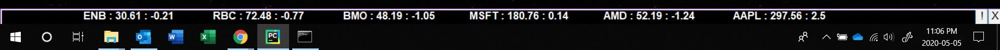

# stockTicker
## Ticker Functionality

**Initalization**

On initalization, a bar will be drawn above windows taskbar with two buttons on the right side: Menu(!), and Close(X).

**TickerTape**

A list of ticker symbols will be imported from the data.txt file and a call through yahoo finance API will be made to fetch current market data.
Data will be displayed on the ticker tape in the format [Sym, Mkt Price, Daily Change], and reported in US dollars

The ticker symbols can be modified through the menu (discussed below).

## Menu Functionality

**Accessing Menu**

The menu can be opened by clicking the menu(!) button in the bottom right cornner.
Any updates made through the menu will not be displayed in the Ticker Tape until
a timed call to the Yahoo finance api is made. (Default Refresh Time = 1 min)

**Adding Ticker Symbols**

Enter desired symbol in the input box and click 'Add Ticker'.
The menu should automatically resize and update, incorporating the new symbol.
If the symbol is already in the ticker list, it will not be added.

**Removing Ticker Symbols**

Ticker symbols can be removed by pressing the remove button adjacent to the symbol 

## Instructions

Insure that python 3 and all dependencies are installed

Run __init__.py

