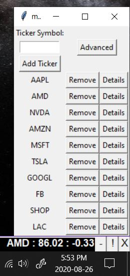

# stockTicker

A stock ticker using tkinter and yfinance

## Ticker Functionality

**Initialization**

On initialization, a bar will be drawn above windows taskbar with three buttons on the right side: Minimize(-), Menu(!), and Close(X).

**TickerTape**

A list of ticker symbols will be imported from the data.db file and a call through yahoo finance API will be made to fetch current market data.
Data will be displayed on the ticker tape in the format [Sym : Mkt Price : Daily Change]. The refresh time for the data can be customized through the advanced menu.

Ticker Inital Run

Ticker Fully Populate

Ticker Reset

The ticker symbols can be modified through the menu (discussed below).

## Minimizing The Display
To minimize the display, click the minimize button (-) in the bottom right corner.
The ticker tape will be replaced with a (+) button in the bottom right corner that will restore the ticker tape when pressed.

## Menu

**Accessing Menu**

The menu can be opened by clicking the menu(!) button in the bottom right corner.
Once an update is made through the menu, the ticker tape will reset and include any changes.

**Adding Ticker Symbols**

To add a stock to the ticker list, enter desired symbol in the input box and click 'Add Ticker'.
The menu will automatically resize and update, incorporating the new symbol.
If the symbol is already in the ticker list, it will not be added.

**Removing Ticker Symbols**

Ticker symbols can be removed by pressing the 'Remove' button adjacent to the symbol.

## Details

To view details for any stock selected, press the 'Details' button adjacent to the symbol located in the menu.
The newly launched window will show the information on the stock price, future earnings releases as well as past dividends and stock splits.
A grid displaying available options will also be shown. Please note that that a subset of the options data will be shown based on volume and open interest filters located in the advanced menu.

To filter options by a particular type (Call/Put), expiration date, or strike price, enter the value in the respective input box and press the filter button.
Filters will be maintained when options refresh.

## Advanced Menu

To open the advanced menu, press the advanced button located in the menu. Through the advanced menu, settings for the stock ticker can be customized.

**Email Alerts**

To enable email alerts, insure that the 'Send Emails' control is set to 'True'.
Populate the 'From Address' and 'To Address' field with the desired email address (ex. "JohnDoe@Outlook.com")
Populate the password location field with the file path of a local text file containing the email password (ex. "C:\Users\JohnDoe\MySecretFolder\Password.txt")
It's recommended that an individual email account is set up for this application if email alerts are desired. 

## Instructions

Insure that python 3 and all dependencies are installed

Run main.py

